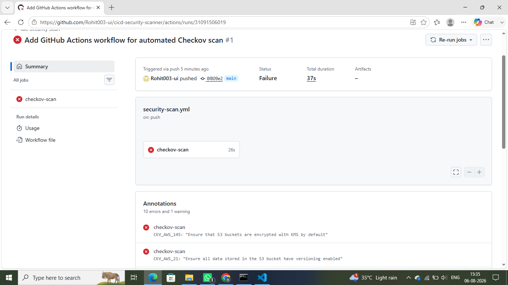
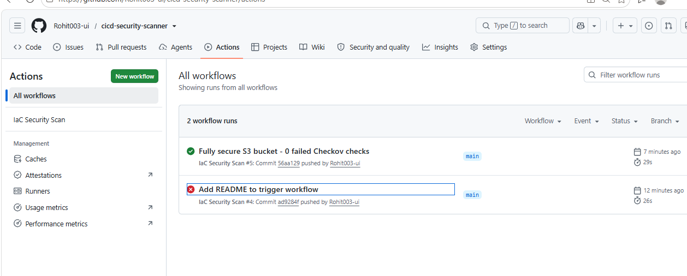

# Cloud-Based CI/CD Security Scanner

An automated DevSecOps pipeline that scans Terraform Infrastructure-as-Code (IaC) for security misconfigurations before deployment, using Checkov and GitHub Actions.

## What This Project Does

Instead of manually reviewing cloud infrastructure code for security mistakes, this pipeline automatically:
1. Scans Terraform files on every push and pull request
2. Detects common misconfigurations (public S3 buckets, missing encryption, open security groups, etc.)
3. Blocks the pipeline if serious issues are found, stopping insecure infrastructure before it ever reaches the cloud

This mirrors real-world DevSecOps practices used to prevent security incidents caused by misconfigured cloud resources, one of the leading causes of cloud data breaches.

## How It Works

Developer pushes Terraform code, GitHub Actions triggers automatically, and Checkov scans the code for misconfigurations. If issues are found, the pipeline fails. If no issues are found, the pipeline passes.

## Before vs After Example 1: S3 Bucket

| | vulnerable-examples/s3-bucket.tf | fixed-examples/s3-bucket-secure.tf |
|---|---|---|
| Public access blocked | No | Yes |
| Encryption at rest | No | Yes (KMS) |
| Versioning | No | Yes |
| Access logging | No | Yes |
| Lifecycle policy | No | Yes |
| Cross-region replication | No | Yes |
| Checkov result | 11 failed checks | 0 failed checks |
| Pipeline status | Blocked | Passed |

## Before vs After Example 2: EC2 Security Group

| | vulnerable-examples/ec2-security-group.tf | fixed-examples/ec2-security-group-secure.tf |
|---|---|---|
| SSH open to internet | Yes (0.0.0.0/0) | No (restricted IP) |
| RDP open to internet | Yes (0.0.0.0/0) | Removed entirely |
| Unrestricted outbound traffic | Yes | Limited to HTTPS |
| IAM role attached | No | Yes |
| EBS encryption | No | Yes |
| IMDSv2 enforced | No | Yes |
| Checkov result | 5 failed checks | 0 failed checks |
| Pipeline status | Blocked | Passed |

## Tech Stack

- Terraform - Infrastructure as Code
- Checkov - static analysis security scanner for IaC
- GitHub Actions - CI/CD automation
- AWS - target cloud provider (S3, EC2 examples)

## Project Structure

cicd-security-scanner/
- .github/workflows/security-scan.yml - GitHub Actions pipeline definition
- terraform/vulnerable-examples/s3-bucket.tf - Intentionally insecure S3 bucket
- terraform/vulnerable-examples/ec2-security-group.tf - Intentionally insecure security group
- terraform/fixed-examples/s3-bucket-secure.tf - Fully secured S3 bucket
- terraform/fixed-examples/ec2-security-group-secure.tf - Fully secured security group
- docs/screenshots/pipeline-fail.png
- docs/screenshots/pipeline-pass.png
- README.md

## Running the Scanner Locally

pip install checkov

checkov -f terraform/fixed-examples/s3-bucket-secure.tf

checkov -f terraform/fixed-examples/ec2-security-group-secure.tf

## Pipeline Screenshots

Pipeline blocked (insecure code):

Pipeline passed (secure code):

## What This Demonstrates

- Understanding of Infrastructure-as-Code security risks across multiple AWS resource types (storage and networking)
- Practical DevSecOps pipeline design (shift-left security)
- CI/CD automation with GitHub Actions
- Hands-on experience with a real, widely-used security scanning tool (Checkov)

## Future Improvements

- Add more resource types (IAM policies, RDS databases)
- Post scan results as automatic PR comments
- Add a simple dashboard summarizing scan history